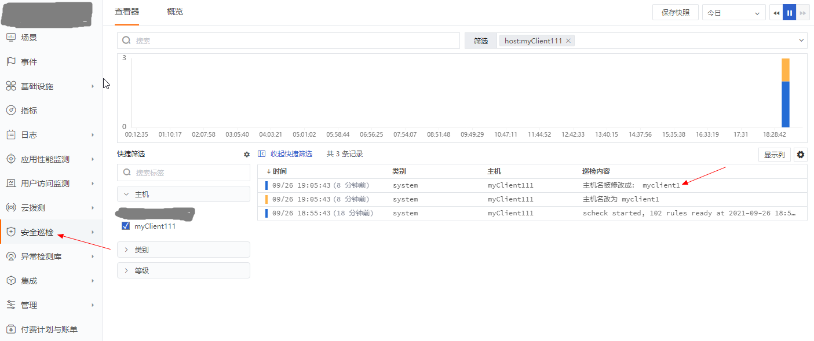

# 用户自定义属于自己的规则文件及lib库

## scheck规则介绍
*lua规则介绍*:

规则脚本由两个文件组成：lua文件和manifest文件，两个文件必须是同时存在！并且文件前缀相同！

- `<rule-name>.lua`：这个是规则的判断脚本，基于lua语法实现，但不能引用，也无法引用标准lua库，只能使用内置的lua库和内置的函数。

- `<rule-name>.manifest`：这个是规则清单文件。当对应的 lua 脚本检测到有问题（result == true），manifest 文件中有一组对应的行为定义

### 清单文件字段说明

| manifest字段 | 字段说明 | 配置说明 |
| :--- | :---- | :---- |
| id | 名称 | 按照id规则加上该脚本的功能命名 |
| category | system | 可使用多种类型：system,os,net,file,db,docker... |
| level | 告警级别 | 可选的类型有：debug,info,warn,error |
| title | 规则抬头名称 | 一般以该规则的功能来进行命名 |
| desc | 说明 | 用文字来展示和具体说明规则的运行结果 |
| cron | 自定义运行间隔时间 | 可参考：[编写cron示例](#编写cron) |
| disabled | 开关 | 可选字段：true或者false |
| os_arch | 支持的操作系统 | 数组类型 可选："windows" "linux" |


 scheck 内置规则在安装目录下`rules.d`中

## 用户自定义专属的规则和lua库
本示例以一个定时查看主机名的规则为例：
1. 编写一个lua文件
在用户目录`custom.rules.d` 下创建一个名称为 10001-hostname.lua 的文件。代码如下：
``` lua
local function check()
    local cache_key = "hostname"
    local old = get_cache(cache_key) --get_cache(key) 是go内置函数 用于lua脚本缓存，搭配set_cache(cache_key, current)使用
    if old == nil then
        local current = hostname()   -- go内置函数 获取主机名
        set_cache(cache_key, current)
        return
    end
    local current =  hostname()
    if old ~= current then
        trigger({Content=current})   -- go内置函数 用于将消息发送到datakit或者本机日志中
        set_cache(cache_key, current)
    end
end
check()
```

> 注意：scheck希望用户自定义的规则名称也能遵守这样的[规范](#lua规则命名规范)

2. 编写一个manifest文件
在用户目录`custom.rules.d` 下创建一个名称为 `10001-hostname.manifest` 的文件。内容如下：

``` toml
id="10001-hostname"
category="system"
level="info"
title="主机名被修改"
desc="主机名被修改成： {{.Content}}"
cron="0 */1 * * *"
# 开关
disabled=false
os_arch=["Linux"]

```

当前的规则清单文件配置的是：每分钟执行一次


3. 重启服务器

```shell
systemctl restart scheck.service
```

4. 将消息发送出去

重启服务器之后，每分钟就会执行一次脚本，可在一分钟之后修改hostname

静态主机名保存在/etc/hostname文件中，可通过命名修改。

``` shell
   hostnamectl set-hostname  myclient1
```

5. 观测

登录[观测云](https://www.guance.com) 控制台->导航栏->安全巡检：查看安装巡检信息，发现有一条消息是修改了主机名

   


## 规则库
*lua库文件和用户自定义库*:

scheck自带的lua引用库文件在安装目录下`rules.d/libs`，函数列表及接口文档可[在线查看](funcs)

lib库文件不需要manifest清单文件，在lua中引用是需要声明一次,比如引用libs中的directorymonitor 需要声明一次：

```lua
local directorymonitor = require("directorymonitor")

local function check()

directorymonitor.add("/usr/bin")
end
check()
```

> 注意：用户不可修改scheck自带的lib库和lua规则文件,每次安装更新和重启服务都会重新覆盖规则文件。


用户自定义的规则和库文件可以放在 `custom.rules.d`目录下，如果有自定义的lua引用库文件，可以放在`custom.rules.d/libs`目录下。

当指向别的路径时，只需要修改配置文件`scheck.conf`:

``` toml
[system]
  # ##(必选) 系统存放检测脚本的目录
  rule_dir = "/usr/local/scheck/rules.d"
  # ##客户自定义目录
  custom_dir = "/usr/local/scheck/custom.rules.d"
  # 可选 用户自定义lua库 不可用rule_dir 系统默认为用户目录下的libs
  custom_rule_lib_dir = "/usr/local/scheck/custom.rules.d/libs"
```
然后重启服务即可。

-------------------
# 附录

## lua规则命名规范

scheck自带的lua是按照类型进行命名的，名称前的ID表示属于某一个规则类型。

用户规则名称应当以数字开头 并且不能小于10000 比如：10001-xxx.lua

scheck自带的规则命名规范：

| ID范围 | 规则类型 |
| :---: | :----: |
| 0000 | 系统缓存 |
| 0001~0199 | system |
| 0200~0299 | 网络 |
| 0300~0310 | 容器相关 |
| 0500~0510 | 数据库 |
| 10000以上 | 用户自定义 |

> 用户自定义lua没有按照命名规范进行命名将会导致规则加载失败。

## manifest文件设置定时cron字段
Scheck支持两种运行方式：间隔执行，长效类型。目前不支持固定时执行！

### 间隔执行cron
```shell
cron="* */1 * * *"  #每分钟执行一次
cron="* * */1 * *"  # 每小时执行一次
cron="* * * */1 *"  # 每天执行一次
```
### 长效性规则

```shell
cron="disable" 或者 cron=""  
```

长效性规则会一直执行，有触发时会在1秒钟上报消息。比如：文件发生变化